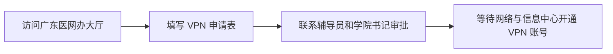

# 如何申请校园 VPN

## 申请前须知

1. 如果已经开通过校园网，则会 **自动获得 VPN 账号** ，无需再次申请。
2. 如果没有开通过校园网，则可以到 `广东医网办大厅` 申请 VPN 账号。

## 申请流程

1.  打开浏览器访问广东医网办大厅 [https://ehall.gdmu.edu.cn](https://ehall.gdmu.edu.cn '广东医科大学网上办事大厅') ，利用主页的搜索框查找 `VPN 用户申请表` 。

    

2.  进入 `VPN 用户申请表` 流程服务，点击 `申请` ，仔细阅读《VPN 使用须知》并下载《VPN 用户安全协议》后，点击 `同意` 。

    

3.  在申请表单中准确填写相关资料，并上传包含个人签名的《VPN 用户安全协议》。

    

    > [!TIP] 提示：
    >
    > 1. 《VPN 用户安全协议》可以打印后签名，也可以使用软件进行电子签名。
    > 2. 《VPN 用户安全协议》需要上传 PDF 格式，如果采取打印后签名的方案，可通过 [Aconvert 网站](https://www.aconvert.com/cn/pdf/) 将照片或扫描件转换为 PDF 文件。

4.  选择自己的辅导员，确认表单信息填写无误后，启动申请流程。

    

5.  请 **自行联系辅导员审批** ，以及让辅导员去 **联系学院书记审批** 。  
    辅导员和学院书记审批通过后，网络与信息中心会在5个工作日内完成 VPN 账号的开通。

    > [!WARNING] 警告：  
    > 大部分人的申请都会卡在这一环节，因为辅导员和学院书记并不会每天查看待审批的申请。因此主动联系辅导员真的很重要！

6.  申请流程结束后，可在流程流转情况中 **查看初始密码** 。

    

    > [!NOTE] 备注：  
    > 用户名 --> 学号  
    > 初始密码 --> 在流程流转情况中查看
