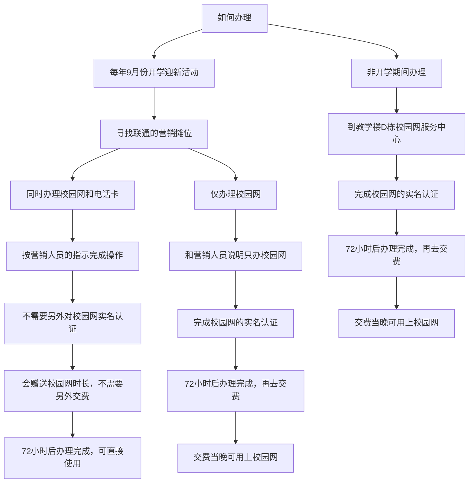

# 如何办理校园网

```mermaid
graph TB
    A[如何办理] --> B[每年9月份开学迎新活动]
    B --> C[寻找联通的营销摊位]
    C --> D[同时办理校园网和电话卡]
    D --> E[按营销人员的指示完成操作]
    E --> F[不需要另外对校园网实名认证]
    F --> G[会赠送校园网时长，不需要另外交费]
    G --> H[72小时后办理完成，可直接使用]
    C --> I[仅办理校园网]
    I --> J[和营销人员说明只办校园网]
    J --> K[完成校园网的实名认证]
    K --> L[72小时后办理完成，再去交费]
    L --> M[交费当晚可用上校园网]
    A --> N[非开学期间办理]
    N --> O[到教学楼D栋校园网服务中心]
    O --> P[完成校园网的实名认证]
    P --> Q[72小时后办理完成，再去交费]
    Q --> R[交费当晚可用上校园网]
```
